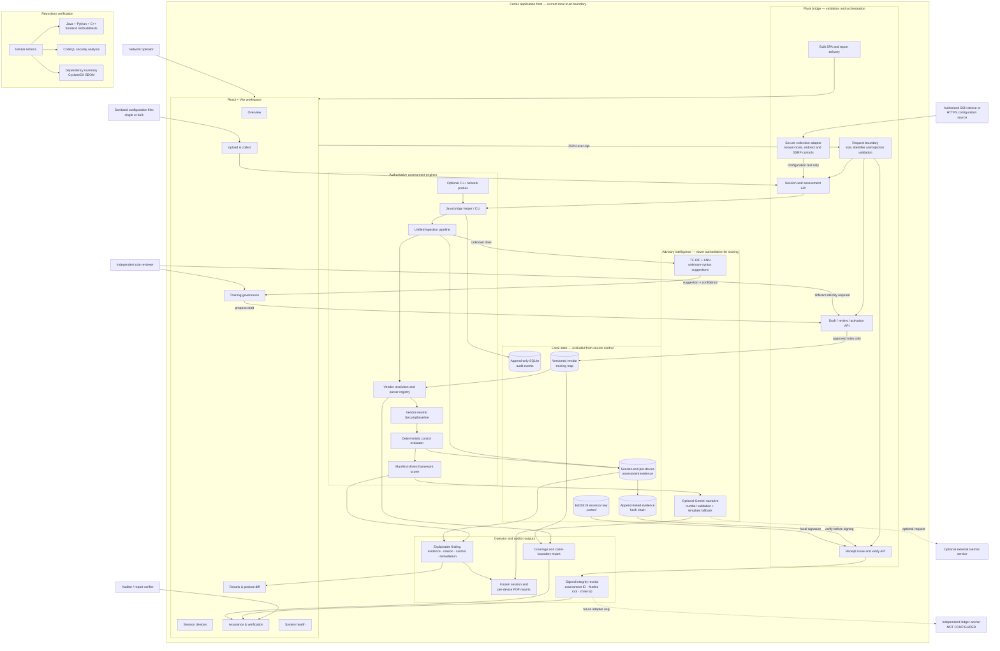

# Cortex architecture

This diagram shows the runtime components, authoritative data flow, governance
path, integrity boundary, external dependencies, and verification pipeline.

## How to read it

- Solid arrows are implemented runtime paths.
- Dotted arrows cross an optional or currently unimplemented external boundary.
- The Java ingestion, evidence and scoring path is authoritative.
- ML and Gemini outputs are advisory and cannot directly create compliance scores.
- A proposed recognition rule is inert until a different reviewer activates it.
- The signed receipt proves integrity inside the local assessor boundary. The
  independent ledger shown at the edge is deliberately marked as not configured.

## Primary assessment sequence

1. The operator submits a file or authorizes a collection target.
2. Flask validates the request; the secure fetcher returns configuration text only.
3. Java resolves the vendor, builds the normalized baseline and evaluates controls.
4. Evidence is appended to the session chain and the deterministic scorer maps it
   to selected frameworks.
5. Cortex presents explainable findings and generates reports from stored evidence.
6. After chain verification, the assurance service signs a Merkle commitment with
   the local Ed25519 assessor key.
7. An auditor can verify the receipt signature and compare it with currently
   available session evidence.
